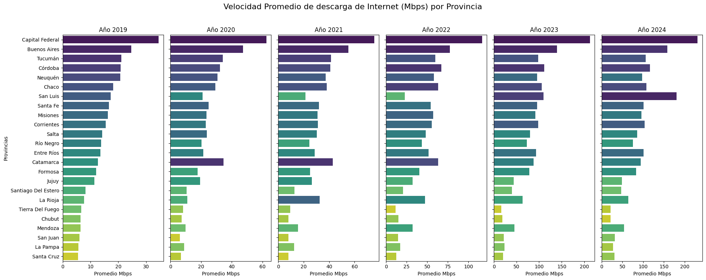
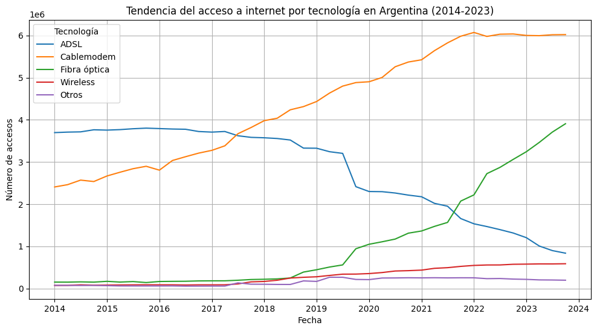
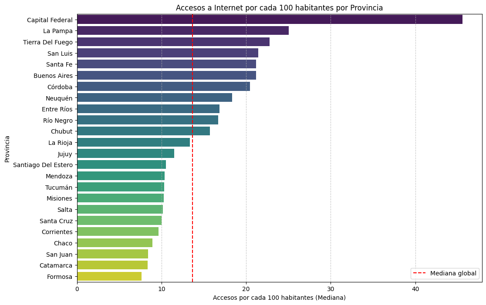
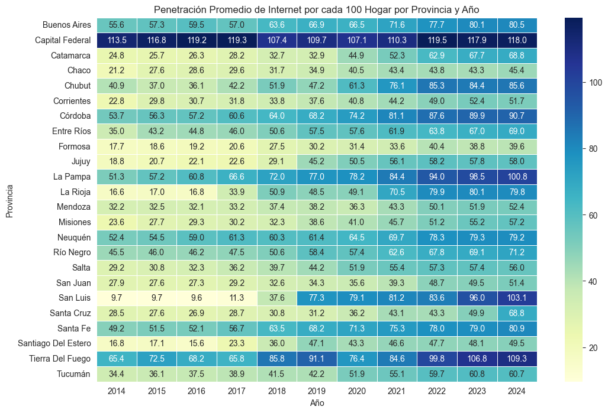
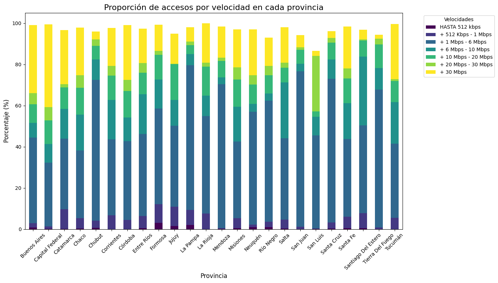
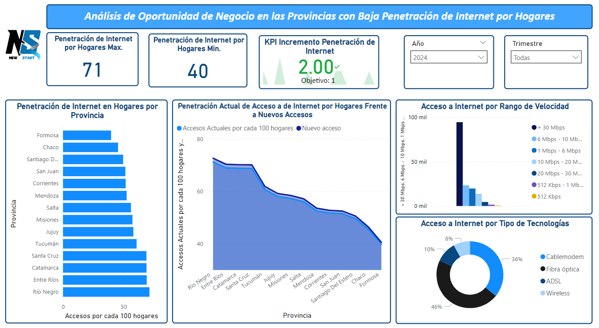

# <h1 align=center> **PROYECTO INDIVIDUAL Nº 2** </h1>

# <h1 align=center>**`Telecomunicaciones`**</h1>

# <h2 align=center> Nombre del Proyecto:</h2>
<h2 align=center>Análisis del Sector Telecomunicaciones en Argentina</h2>


## ```Introducción```

El sector de telecomunicaciones en Argentina juega un rol crucial en la conectividad y el acceso a la información. En este proyecto, realizamos un análisis exhaustivo de la calidad y accesibilidad del servicio de internet, explorando su penetración en distintas provincias, velocidad de conexión y más. El objetivo es identificar áreas de mejora y nuevas oportunidades para la empresa 'NewStart', enfocada en ofrecer servicios de internet de alta calidad.

## ```Objetivos```
- Identificar el comportamiento del sector telecomunicaciones, analizando el acceso a internet a nivel nacional y por provincias.
- Explorar oportunidades de negocio, detectando brechas en la calidad y penetración del servicio.

## ```Tecnologías Utilizadas```
- Lenguaje de Programación: Python
- Librerías:
    - Pandas para manipulación y análisis de datos.
    - Matplotlib y Seaborn para la visualización.
    - NumPy para operaciones numéricas.
- Herramientas Adicionales: Jupyter Notebooks para desarrollo y Power BI para visualización.

## ```Datos```
Los datos utilizados provienen del *ENACOM* (Ente Nacional de Comunicaciones) de Argentina, en el [Link](https://indicadores.enacom.gob.ar/datos-abiertos) encontraran los datos abiertos del sector de telecomunicaciones, del cual se extrayeron información de acceso, velocidad de conexión y tecnologías empleadas, etc.

## ```Desarrollo del Proyecto```
1. Velocidad promedio de descarga de Internet (Mbps) por provincias

Este análisis muestra cómo es la velocidad de promedio de descarga de Internet en entre las provincias, Asimismo, muestran diferentes patrones de crecimiento; observándose que algunas de ellas experimentan un crecimiento más rápido que otras; además el gráfico permite identificar provincias con baja velocidad que podrían beneficiarse de mejoras.

Gráfico 1: Velocidad promedio de descarga de Internet (Mbps) por provincias


2. Accesos a internet por tipo de tecnología

El análisis muestran una clara tendencia de cambio tecnológico en el acceso a Internet en Argentina, con un desplazamiento hacia tecnologías más modernas como la fibra óptica y una disminución del uso de tecnologías más antiguas como ADSL.

La adopción de fibra óptica y el predominio del cablemodem sugieren una demanda creciente por velocidad y calidad en las conexiones, los cuales podrían traducirse en oportunidades de mercado en las provincias.

Gráfico 2: Tendencia del acceso a internet por tecnología en Argentina (2014-2023)


3. Penetración de internet por cada 100 habitantes por provincia

El análisi evidencia una gran disparidad en el acceso a internet entre las diferentes provincias. Las provincias ubicadas en la parte superior del gráfico (Capital Federal, La Pampa, Tierra del Fuego) tienen un acceso a internet significativamente mayor en comparación con las provincias ubicadas en la parte inferior (Formosa, Catamarca, San Juan).


Gráfico 3: Penetración de Internet por cada 100 habitantes por Provincia


4. Penetración de internet en hogares por provincia y año

Este análisis se realizó mediante un mapa de calor, observándose una tendencia al alza en la penetración de internet en todas las provincias a lo largo de los años analizados, esto indica un crecimiento sostenido en el acceso a internet en los hogares argentinos. Sin embargo, existen diferencias marcadas entre las provincias como, Capital Federal y Tierra del Fuego que presentan los índices de penetración más altos; mientras que provincias como Formosa y Chaco muestran los índices más bajos. Esta disparidad refleja las desigualdades provinciales en términos de desarrollo económico y acceso a infraestructura.


Gráfico 4: Penetración de Internet por cada 100 Hogares por provincia y año


5. Accesos a internet desglosados por velocidad de conexión

Exploramos el acceso a internet según los distintos rangos de velocidad, observándose que la Capital Federal destaca por tener una alta proporción de conexiones de 30 Mbps o más, lo que indica una mayor adopción de servicios de alta velocidad, seguido de la provincia de Buenos Aires. Asimismo, se observa una gran heterogeneidad en la distribución de velocidades a lo largo del país. Mientras algunas provincias concentran un alto porcentaje de conexiones de alta velocidad, otras aún presentan una mayor proporción de conexiones de baja velocidad.

Gráfico 5: Accesos Desglosados por Velocidad


## ```KPIs```
- KPI 1: Incrementar en un 5% la velocidad descarga de internet, por provincia.
- KPI 2: Aumentar en un 2% el acceso al servicio de internet para el próximo trimestre, cada 100 hogares, por provincia.
- KPI 3: Aumentar en un 5% de accesos con velocidades superiores a 20 Mbps 

## ```Dashboard```
El Dashbooard del proyecto, muestra las métricas claves y gráficos interactivos para una mejor comprensión.

Gráfico 6: Dashboard del Proyecto


## ```Conclusiones y Recomendaciones```

- Conclusiones: 
    - El análisi del sector telecomunicaciones en Argentina muestra una marcada desiguadad en las velocidades de conexión a internet en las provincias.
    - Las provincias más desarrolladas como la Capital Federal y Buenos Aires, cuentran con infraestructuras avanzadas y mayores velocidades de conexión, miesntras que muchas provincias muestan una brecha digital significativa. Esta desigualdad se refleja también en la penetración de internet, que si bien ha crecido de manera sostenida en los últimos años, aún presenta disparidades notables entre provincias.
    - El predominio de tecnologías modernas como la fibra óptica sugiere un cambio hacia conexiones más rápidas y estables, pero todavía persiste un desafío en la expansión de estas tecnologías hacia áreas con menor acceso.

- Recomendaciones:

Para cerrar la brecha digital y mejorar la conectividad, se recomienda que la empresa enfoque sus esfuerzos en expandir la infraestructura de fibra óptica hacia las provincias con velocidades de conexión más bajas. Esto podría lograrse mediante alianzas estratégicas, inversiones públicas y privadas, y programas de incentivos.

## ```Estructura del Repositorio```
- Datasets/: Contiene los archivos de datos utilizados en el análisis.
- Img/: Carpeta que almacena los gráficos generados.
- Notebooks/: Jupyter Notebooks con el desarrollo del análisis.
- README.md: Archivo de documentación.

## ```Autor```
Jossy Romero 
<br/>
Contacto: [](https://www.linkedin.com/in/jossy-romero-villanueva-31b11657/)

